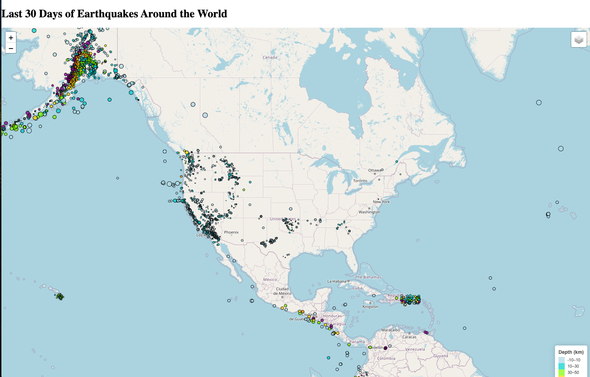

# Earthquake Map Visualization

This project visualizes earthquake data from the past 30 days worldwide using [Leaflet.js](https://leafletjs.com/) and [D3.js](https://d3js.org/). The map includes earthquake markers that vary in size based on earthquake magnitude and color based on depth, providing an interactive way to understand recent earthquake activity.

## Features

- **Map Layers**: Users can toggle between a street map and a topographic map.
- **Earthquake Markers**: Markers are dynamically sized according to earthquake magnitude and colored according to earthquake depth.
- **Popups**: Each marker has a popup displaying location, magnitude, and depth information.
- **Legend**: A legend on the map describes the color coding based on depth, making it easier to interpret earthquake data visually.

## Technologies Used

- **Leaflet.js** for map rendering and controls.
- **D3.js** for loading GeoJSON earthquake data.
- **HTML/CSS** for basic layout and styling.

## Project Structure

```
Leaflet-Part-1
├── index.html         # Main HTML file
├── static
│   ├── css
│   │   └── style.css  # Custom CSS for styling the map and legend
│   └── js
│       └── logic.js   # JavaScript code for map creation, data fetching, and visualization
└── README.md          # Project documentation
```

## Setup and Installation

1. Clone this repository or download the files.
2. Open `index.html` in your browser to view the map.

   ```bash
   git clone <repository-url>
   cd <repository-directory>
   open index.html
   ```

3. Ensure you have an internet connection to load external libraries (Leaflet.js, D3.js) and access earthquake data from the USGS.

## Code Explanation

### HTML (`index.html`)

The `index.html` file sets up the basic structure of the webpage, loads the necessary libraries, and provides an `<h1>` title and a `<div>` to hold the map.

- **Leaflet and D3** are included via CDNs.
- **Title and Map Container**: The title displays "Last 30 Days of Earthquakes Around the World," and the map container is rendered in the `<div id="map">` element.
- **External JavaScript and CSS**: Links to custom JavaScript (`logic.js`) and CSS (`style.css`) files in the `static` folder.

### JavaScript (`logic.js`)

The main JavaScript file initializes the map and adds interactive earthquake data:

1. **Tile Layers**: Two base layers (Street Map and Topographic Map) are defined for user selection.
2. **Earthquake Data**:
   - Earthquake data is fetched from the [USGS Earthquake GeoJSON feed](https://earthquake.usgs.gov/earthquakes/feed/v1.0/summary/all_month.geojson) using D3.
   - Earthquake markers are created with `L.circle` markers, where:
     - **Size** is based on magnitude (larger magnitude = larger marker).
     - **Color** is based on depth (deeper earthquakes have darker colors).
3. **Legend**: A color-coded legend on the bottom right of the map explains the depth categories for the earthquake markers.
4. **Map Controls**:
   - **Layer Control**: Allows users to toggle between base maps and the earthquake data layer.
   - **Popups**: Each earthquake marker includes a popup with location, magnitude, and depth information.

### CSS (`style.css`)

Custom styling is applied to ensure the map and legend look clean and professional:

- **Map Sizing**: The map takes up the full screen.
- **Legend Styling**: Adds background, border radius, and box shadow to make the legend distinct and readable.

## Screenshot

Here’s an example of the earthquake map with various features:



## License

This project is licensed under the GNU License. See the [LICENSE](LICENSE) file for details.
